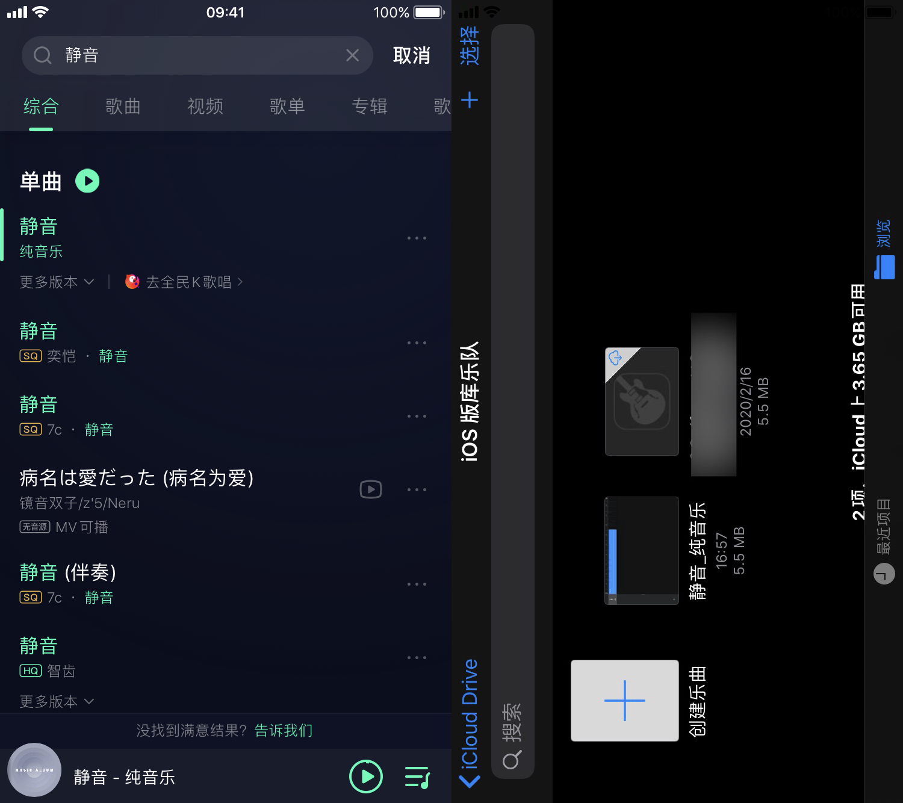

### 需求：

- 应用场景使用计时器实现番茄钟，25min 倒计时，5min 倒计时。
- 在办公区域提醒模式改为振动提示，取消铃声提示

### 现状分析：

1. 计时器的铃声提醒与所处模式无关，为强提醒
2. 计时器实现震动的方式依靠响铃模式/静音模式振动开启
3. 计时器可以实现中断音乐播放-->切换到停止播放属性▶

### 解决方案：

由于无法取消强提醒的铃声提示，转换思路，用无声的音频替换掉铃声实现播放🔇音频。

具体步骤：

1. 音频素材--->QQ音乐 App 搜索「静音」
2. 将音频导入到铃声设置中-->库乐队

下一版文章关于如何联合 atimelogger 实现番茄钟模式

